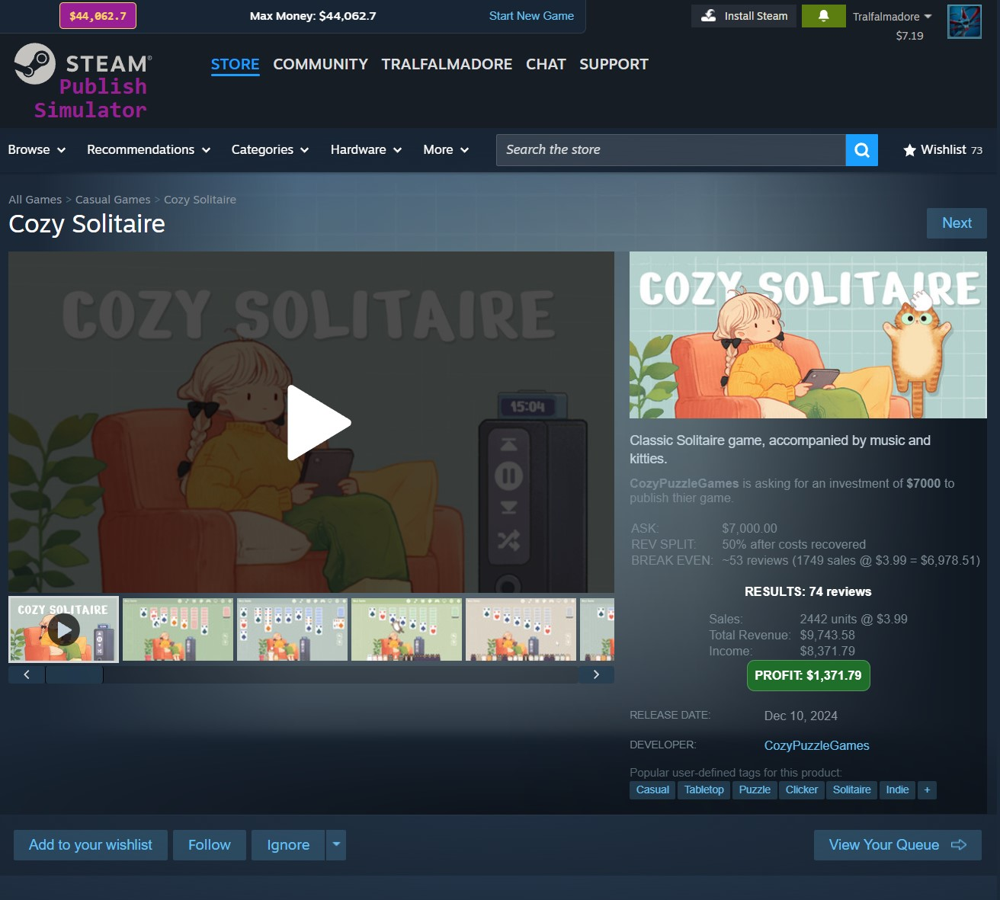

# Steam Publish Simulator

## Overview

Steam Publish Simulator is a fork of Jonas Review Guesser. It is a guessing game where you look at steam pages with some details hidden, and
decide if you want to invest in the game. As you get more money, you'll see more successful games. Keep investing until you're rich!




## Installation (Local Chrome Extension)

### Prerequisites

- **Google Chrome** installed.
- The extension source code downloaded:
  - Either via `git clone`:
    ```bash
    git clone https://github.com/LooveToLoose/Jonas-Review-Guesser
    ```
  - Or by downloading a ZIP and extracting it.

### Step 1: Open Chrome Extensions Page

- In Chrome, go to:
  - `chrome://extensions/`
- Enable **Developer mode**:
  - Toggle the **Developer mode** switch in the top-right corner.

### Step 2: Load the Unpacked Extension

- Click **“Load unpacked”**.
- Select the folder containing the extension:
  - The folder that includes `manifest.json`.
- Confirm that **Jonas Review Guesser** appears in the list of extensions.

### Step 3: Set Steam language to ENGLISH!
- **Set your language to "English"!** This is crucial for the current version to work.

### Step 4: Verify It Works

- Make sure the extension is **enabled** (toggle is on).
- Open any Steam store page:
  - Check if:
    - Review counts are replaced with guess buttons.
    - The **Next (Raw)** and **Next (Balanced)** buttons appear at the top of the page.

---

## Enabling / Disabling the Extension

### Enable

- Go to `chrome://extensions/`.
- Find **Jonas Review Guesser**.
- Ensure the toggle is switched **on**.

### Disable

- Go to `chrome://extensions/`.
- Find **Jonas Review Guesser**.
- Switch the toggle **off** to temporarily disable it.
- (Optional) Click **Remove** if you want to uninstall it completely.

---

## Updating the Extension

### When You Pull New Changes (Git) or Download a New Version

- If you updated the extension files by:
  - Running `git pull` in the project folder, or
  - Replacing the folder with a newer version,

do the following:

### Step 1: Go to the Extensions Page

- Open `chrome://extensions/`.
- Ensure **Developer mode** is still enabled.

### Step 2: Reload the Extension

- Find **Jonas Review Guesser**.
- Click the **Reload** button (⟲) on the extension card.
  - This loads the latest version of the source from the folder.

### Step 3: If Something Breaks

- Disable and re-enable the extension.
- If issues persist:
  - Click **Remove**.
  - Then click **Load unpacked** again and select the updated folder.

---

## License

- Short summary:
  - Non-commercial use only.
  - Forking, modifying, and renaming allowed.
  - Giving credit is not required.
  - No warranty, no support, use at your own risk.

See the license file for more details.

## FAQ

> Will there be a Firefox version?

Only if one of you makes one.

> Can you add *(insert any feature)* to this extension?

Probably not. I'm happy to try out your version if you add any cool stuff.

> I think it should be different. I think it should be...

Okay. Just make it.

> Can you make a YouTube video guessing our Steam games?

Sure, I'll do that on my YT channel (@jonastyroller) and Discord. Sounds like a great idea. 

